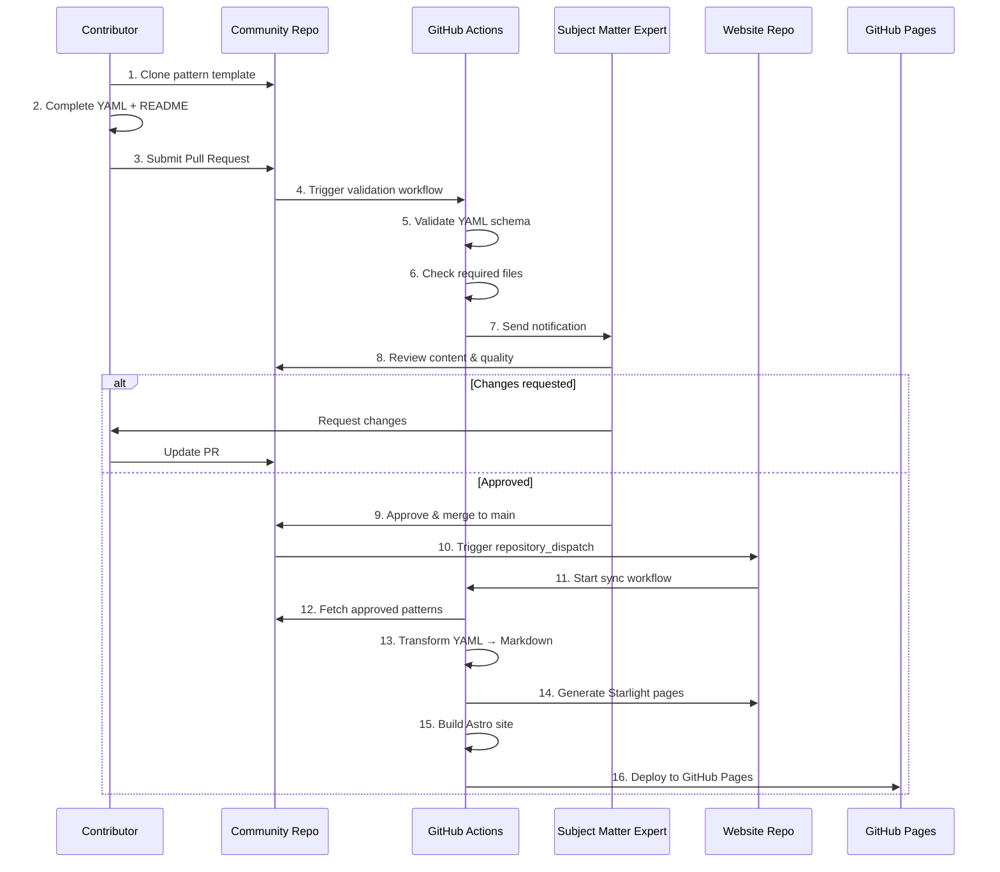
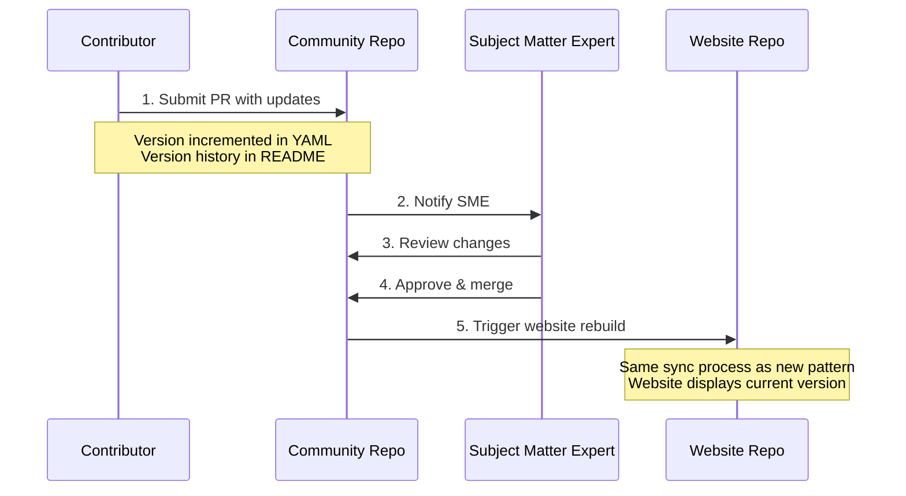

# Technical Patterns Catalog - Architecture Document

## Table of Contents

1. [Overview](#overview)
2. [System Architecture](#system-architecture)
3. [Repository Structure](#repository-structure)
4. [Data Models](#data-models)
5. [Integration Workflow](#integration-workflow)
6. [Technology Stack](#technology-stack)
7. [Pattern Lifecycle](#pattern-lifecycle)
8. [Security Architecture](#security-architecture)
9. [Deployment Architecture](#deployment-architecture)
10. [Extensibility Design](#extensibility-design)
11. [Open Technical Decisions](#open-technical-decisions)

---

## Overview

The Technical Patterns Catalog is a distributed system comprising two independent GitHub repositories that work together to provide a community-driven catalog of technical architecture patterns. The architecture implements a clear separation of concerns between content management (community repository) and content presentation (catalog website).

### Architecture Principles

1. **Separation of Concerns**: Site administration and community contributions are clearly separated
2. **Automation First**: Manual processes are minimized through GitHub Actions
3. **Native Features**: Leverage Astro/Starlight capabilities over custom solutions
4. **Git as Source of Truth**: All content and configuration versioned in Git
5. **Static Generation**: No runtime dependencies or backend services
6. **Extensibility**: Design supports future artifact types beyond patterns

---

## System Architecture

### High-Level Architecture

```
┌─────────────────────────────────────────────────────────────┐
│                    Community Contributors                    │
└────────────────────┬────────────────────────────────────────┘
                     │
                     │ 1. Clone template
                     │ 2. Complete YAML + README
                     │ 3. Submit PR
                     ▼
┌─────────────────────────────────────────────────────────────┐
│          Community Pattern Repository (GitHub)              │
│                                                              │
│  /patterns/                                                  │
│    ├── pattern-template/                                    │
│    │     ├── pattern.yaml (metadata template)               │
│    │     ├── README.md (documentation template)             │
│    │     ├── diagrams/                                      │
│    │     └── implementation/                                │
│    │                                                         │
│    └── pattern-xyz/                                         │
│          ├── pattern.yaml                                   │
│          ├── README.md                                      │
│          ├── diagrams/                                      │
│          └── implementation/                                │
│                                                              │
│  GitHub Actions:                                            │
│    - YAML schema validation                                 │
│    - Required files check                                   │
│    - SME notification                                       │
└────────────────────┬────────────────────────────────────────┘
                     │
                     │ 4. Automated validation
                     │ 5. SME review & approval
                     │ 6. Merge to main
                     │
                     │ 7. Trigger website rebuild
                     ▼
┌─────────────────────────────────────────────────────────────┐
│            Catalog Website Repository (GitHub)              │
│                                                              │
│  Astro Starlight Site:                                      │
│    /src/                                                     │
│      ├── content/                                           │
│      │     ├── docs/                                        │
│      │     └── patterns/ (generated from YAML)             │
│      ├── components/                                        │
│      └── config/                                            │
│                                                              │
│  GitHub Actions:                                            │
│    - Fetch approved patterns from community repo            │
│    - Transform YAML → Starlight pages                       │
│    - Build static site                                      │
│    - Deploy to GitHub Pages                                 │
└────────────────────┬────────────────────────────────────────┘
                     │
                     │ 8. Deploy static site
                     ▼
┌─────────────────────────────────────────────────────────────┐
│                    GitHub Pages                              │
│              (Static Site Hosting)                           │
│                                                              │
│    - Searchable catalog                                      │
│    - Pattern browsing & filtering                            │
│    - Responsive documentation                                │
└─────────────────────────────────────────────────────────────┘
                     │
                     │ 9. Browse & search
                     ▼
┌─────────────────────────────────────────────────────────────┐
│                     End Users                                │
└─────────────────────────────────────────────────────────────┘
```

### Component Responsibilities

#### Community Pattern Repository
- **Purpose**: Version control for community-submitted patterns
- **Owner**: Community contributors with SME oversight
- **Responsibilities**:
  - Store pattern submissions (YAML, README, diagrams)
  - Validate pattern schema and structure
  - Manage pull request workflow
  - Notify SMEs of new submissions
  - Maintain pattern templates
  - Support extensibility for future artifact types

#### Catalog Website Repository
- **Purpose**: Public-facing documentation and catalog
- **Owner**: Site administrators
- **Responsibilities**:
  - Host Astro Starlight website
  - Fetch and transform approved patterns
  - Generate static site
  - Deploy to GitHub Pages
  - Provide search and filtering capabilities
  - Maintain site configuration and branding

---

## Repository Structure

### Community Pattern Repository

```
/
├── README.md                          # Repository overview
├── CONTRIBUTING.md                    # Contribution guidelines
├── LICENSE                            # Open source license
├── .github/
│   └── workflows/
│       ├── validate-pattern.yml       # Schema validation on PR
│       ├── notify-reviewers.yml       # Notify SMEs on PR
│       └── sync-to-website.yml        # Trigger website rebuild on merge
│
├── patterns/                          # V1: Pattern submissions
│   ├── pattern-template/              # Template for new patterns
│   │   ├── pattern.yaml               # YAML metadata template
│   │   ├── README.md                  # Documentation template
│   │   ├── diagrams/                  # Diagram folder
│   │   │   └── architecture.png       # Example diagram
│   │   └── implementation/            # Optional code folder
│   │       └── example.tf             # Example implementation
│   │
│   └── [pattern-name]/                # Actual pattern submission
│       ├── pattern.yaml
│       ├── README.md
│       ├── diagrams/
│       │   └── architecture.png
│       └── implementation/ (optional)
│
├── workflows/                         # Future: Workflow submissions
│   └── workflow-template/
│
├── solutions/                         # Future: Solution submissions
│   └── solution-template/
│
├── applications/                      # Future: Application submissions
│   └── application-template/
│
└── scripts/
    ├── validate-yaml.js               # YAML validation script
    └── generate-pattern-id.js         # Pattern ID generator
```

### Catalog Website Repository

```
/
├── README.md
├── LICENSE
├── astro.config.mjs                   # Astro configuration
├── package.json
├── tsconfig.json
│
├── .github/
│   └── workflows/
│       ├── build-deploy.yml           # Build and deploy to GitHub Pages
│       └── sync-patterns.yml          # Sync patterns from community repo
│
├── public/                            # Static assets
│   ├── images/
│   └── favicon.ico
│
├── src/
│   ├── content/
│   │   ├── docs/                      # General documentation
│   │   │   ├── index.md
│   │   │   ├── getting-started.md
│   │   │   └── contributing.md
│   │   │
│   │   └── patterns/                  # Generated pattern pages
│   │       └── [pattern-id].md        # Auto-generated from YAML
│   │
│   ├── components/                    # Custom Starlight components
│   │   ├── PatternCard.astro
│   │   ├── TechnologyBadge.astro
│   │   └── VersionHistory.astro
│   │
│   ├── layouts/
│   │   └── PatternLayout.astro        # Custom pattern page layout
│   │
│   └── utils/
│       ├── pattern-transformer.ts     # YAML → Markdown transformer
│       └── pattern-fetcher.ts         # Fetch patterns from community repo
│
└── scripts/
    └── sync-patterns.js               # Script to sync and transform patterns
```

---

## Data Models

### Pattern YAML Schema

```yaml
# Basic Information
title: string (required)
description: string (required)

# Author Information
author:
  name: string (required)
  email: string (required)
  github: string (required)
  organization: string (optional)

# Pattern Classification
category: enum (required)
  # Options: automation, observability, security, monitoring, integration, data-protection

# Discoverability
tags: string[] (required)

# Technologies
technologies: (required)
  - name: string
    type: string

# Use Case
use_case: string (required, multiline)

# Architecture
architecture_diagram: string (required, relative path)

# Prerequisites
prerequisites: string[] (required)

# Implementation (optional)
implementation:
  repo_url: string (optional)
  language: enum (optional)
    # Options: javascript, python, java, go, typescript, csharp, other
  framework: enum (optional)
    # Options: SAM, CDK, Terraform, CloudFormation, Pulumi, other, none
  code_snippets: (optional)
    - file: string
      title: string
      description: string
      language: string

# Security (optional)
security: string[]

# Limitations (optional)
limitations: string[]

# Relationships (optional)
related_patterns: string[]
related_plays: string[]

# Metadata
created_date: string (required, YYYY-MM-DD)
last_updated: string (required, YYYY-MM-DD)
version: string (required, semver)
status: enum (required)
  # Options: active, deprecated, experimental
```

### Pattern README Structure

The README.md follows a standardized template with the following sections:

- **Overview**: Problem statement, benefits, when to use
- **Architecture**: Diagram, components, data flow
- **Prerequisites**: Required tools, accounts, permissions
- **Implementation**: Step-by-step deployment instructions
- **Configuration**: Parameters, environment variables
- **Testing**: Manual and automated testing procedures
- **Deployment**: Local development and production deployment
- **Monitoring and Observability**: Metrics, logs, alerts
- **Cost Estimation**: Monthly cost, cost drivers, optimization tips
- **Security Considerations**: Authentication, authorization, encryption
- **Performance Characteristics**: Latency, throughput, scalability
- **Troubleshooting**: Common issues and solutions
- **Cleanup**: Resource removal instructions
- **Limitations**: Known limitations
- **Alternatives**: Alternative patterns
- **Related Patterns**: Links to related patterns
- **Resources**: Additional documentation and references
- **Changelog**: Version history

---

## Integration Workflow

### Pattern Submission Workflow



### Pattern Update Workflow



---

## Technology Stack

### Catalog Website

| Component | Technology | Justification |
|-----------|------------|---------------|
| **Framework** | Astro Starlight | Built-in documentation features, excellent performance, native search |
| **Language** | TypeScript | Type safety, better developer experience |
| **Styling** | Native Starlight themes | Consistent documentation design, minimal custom CSS |
| **Search** | Starlight built-in search | Native feature, no external dependencies |
| **Deployment** | GitHub Actions → GitHub Pages | Free hosting, automated deployment |
| **Content Format** | Markdown (generated from YAML) | Starlight native format |

### Community Repository

| Component | Technology | Justification |
|-----------|------------|---------------|
| **Metadata Format** | YAML | Human-readable, structured, easy validation |
| **Documentation Format** | Markdown | Universal, easy to write, good tooling |
| **Validation** | GitHub Actions + JSON Schema | Automated, runs on PR submission |
| **Notification** | GitHub Actions (TBD mechanism) | Integrated with PR workflow |

### Integration Layer

| Component | Technology | Justification |
|-----------|------------|---------------|
| **Trigger Mechanism** | `repository_dispatch` or `workflow_dispatch` | GitHub Actions native, reliable |
| **Pattern Sync** | GitHub Actions with Node.js script | Programmatic access to both repos |
| **Transformation** | TypeScript/JavaScript | Runs in GitHub Actions, processes YAML to Markdown |

---

## Pattern Lifecycle

### States

1. **Draft**: Pattern being developed by contributor (in PR)
2. **In Review**: Pattern submitted, awaiting SME review (open PR)
3. **Changes Requested**: SME requested modifications (PR with requested changes)
4. **Approved**: SME approved, ready to merge (approved PR)
5. **Active**: Pattern merged and live on website (status: active in YAML)
6. **Deprecated**: Pattern no longer recommended (status: deprecated in YAML)
7. **Experimental**: Pattern in testing phase (status: experimental in YAML)

### Lifecycle Diagram

```
┌──────┐     ┌────────────┐     ┌──────────────────┐     ┌──────────┐
│Draft │────▶│ In Review  │────▶│Changes Requested │────▶│  Draft   │
└──────┘     └─────┬──────┘     └──────────────────┘     └──────────┘
                   │                                             │
                   │                                             │
                   ▼                                             │
             ┌──────────┐                                        │
             │ Approved │◀───────────────────────────────────────┘
             └─────┬────┘
                   │
                   ▼
             ┌──────────┐     ┌──────────────┐
             │  Active  │────▶│ Experimental │
             └─────┬────┘     └──────────────┘
                   │
                   ▼
             ┌────────────┐
             │ Deprecated │
             └────────────┘
```

---

## Security Architecture

### Access Control

#### Community Repository
- **Public Read**: Anyone can view patterns
- **Write Access**: Contributors via PR (fork & PR model)
- **Merge Access**: SME reviewers only
- **Admin Access**: Repository maintainers

#### Website Repository
- **Public Read**: Anyone can view source
- **Write Access**: Site administrators only
- **GitHub Actions**: Service account with specific permissions

### Security Measures

1. **Branch Protection**
   - Require PR reviews for main branch
   - Require status checks to pass
   - No direct commits to main

2. **GitHub Actions Security**
   - Use minimal required permissions
   - Secrets for cross-repo access (GitHub tokens)
   - Dependabot for dependency updates

3. **Content Validation**
   - YAML schema validation
   - File structure validation
   - No executable code in YAML
   - Sanitize content before rendering

4. **Deployment Security**
   - HTTPS only for GitHub Pages
   - No secrets in public repos
   - Audit logging via GitHub

---

## Deployment Architecture

### GitHub Pages Deployment

```
┌─────────────────────────────────────────────────────────┐
│              Website Repository                          │
│                                                          │
│  GitHub Actions Workflow:                               │
│  ┌────────────────────────────────────────────┐        │
│  │  1. Checkout code                           │        │
│  │  2. Setup Node.js                           │        │
│  │  3. Install dependencies                    │        │
│  │  4. Fetch patterns from community repo      │        │
│  │  5. Transform YAML → Markdown               │        │
│  │  6. Build Astro site (npm run build)        │        │
│  │  7. Deploy dist/ to gh-pages branch         │        │
│  └────────────────────────────────────────────┘        │
└───────────────────────┬─────────────────────────────────┘
                        │
                        │ Push to gh-pages branch
                        ▼
┌─────────────────────────────────────────────────────────┐
│                  GitHub Pages                            │
│                                                          │
│  - Serves content from gh-pages branch                  │
│  - Custom domain support (optional)                     │
│  - HTTPS by default                                     │
│  - CDN distribution                                     │
└─────────────────────────────────────────────────────────┘
```

### CI/CD Pipeline

**Community Repository CI**
- Trigger: Pull request opened/updated
- Actions:
  1. Validate YAML schema
  2. Check required files exist
  3. Lint markdown
  4. Report status to PR
  5. Notify SMEs (if validation passes)

**Website Repository CI/CD**
- Trigger 1: Push to main (manual changes)
- Trigger 2: `repository_dispatch` from community repo (pattern merge)
- Actions:
  1. Fetch latest patterns
  2. Transform patterns
  3. Build Astro site
  4. Run tests (optional)
  5. Deploy to GitHub Pages

---

## Extensibility Design

### Supporting Multiple Artifact Types

The architecture is designed to support future artifact types (workflows, solutions, applications) with minimal changes:

#### Repository Structure
```
/patterns/          # V1
/workflows/         # Future
/solutions/         # Future
/applications/      # Future
```

#### Shared Components
- **Validation Framework**: Extensible to new YAML schemas
- **GitHub Actions**: Parameterized workflows
- **Transformation Logic**: Abstract base class for transformers
- **Website Structure**: Dynamic routing based on artifact type

#### Implementation Strategy

1. **Schema Extension**
   - Create new YAML schema for each artifact type
   - Reuse common fields (author, version, etc.)
   - Type-specific fields in separate section

2. **Validation Extension**
   - Add new JSON schema files
   - Update validation workflow to detect type
   - Reuse common validation logic

3. **Website Extension**
   - Add new content sections in Starlight
   - Create type-specific components
   - Update navigation configuration
   - Extend search to include new types

4. **Workflow Extension**
   - Same PR and review process
   - Type-specific reviewers (via CODEOWNERS)
   - Same integration workflow

### Future Artifact Type Example: Workflows

```yaml
# workflow.yaml
title: "Example Workflow"
type: "workflow"  # New field to distinguish type
description: "Process workflow description"
author: {...}
category: "process"
steps:
  - name: "Step 1"
    description: "..."
    tools: [...]
related_patterns: [...]  # Shared field
version: "1.0.0"         # Shared field
```

---

## Technical Decisions

### 1. Repository Sync Trigger Mechanism

**DECISION: Option A - `repository_dispatch`** ✅

Every approved pull request merged to main will automatically trigger a website rebuild.

**Rationale:**
- Native GitHub feature
- Real-time sync on merge
- Secure with GitHub tokens
- Reliable and auditable
- Automatic updates without manual intervention

**Implementation:**
```yaml
# Community repo (patterns): .github/workflows/trigger-website-sync.yml
# Repository: https://github.com/moayadiorg/patterns
on:
  push:
    branches: [main]
jobs:
  trigger-sync:
    runs-on: ubuntu-latest
    steps:
      - name: Trigger website rebuild
        run: |
          curl -X POST \
            -H "Authorization: token ${{ secrets.WEBSITE_REPO_TOKEN }}" \
            -H "Accept: application/vnd.github.v3+json" \
            https://api.github.com/repos/moayadiorg/catatlog/dispatches \
            -d '{"event_type":"pattern-updated"}'
```

**Repositories:**
- **Patterns Repository**: https://github.com/moayadiorg/patterns
- **Catalog Website Repository**: https://github.com/moayadiorg/catatlog
- **Website URL**: https://moayadiorg.github.io/catatlog

### 2. SME Notification Mechanism

**DECISION: Option A - GitHub Native Notifications** ✅
**FUTURE: Option C - Slack Integration** 🔮

**Rationale:**
- Zero configuration needed for GitHub
- SMEs already use GitHub notifications
- Slack can be added as enhancement in future phase
- Deferred until V2 or later based on team needs

**Implementation:**
```yaml
# .github/CODEOWNERS
/patterns/**  @sme-team
```

**Future Enhancement:**
Slack notifications can be added via GitHub Actions when needed.

### 3. Pattern ID Generation

**DECISION: Option C - Folder Name as ID** ✅

**Rationale:**
- Simple and predictable
- Human-readable
- Easy to reference
- Enforced via PR review
- No additional tooling required

**Naming Convention:** `category-technology-purpose`

**Examples:**
- `automation-terraform-aws-backup`
- `security-vault-secrets-management`
- `observability-prometheus-monitoring`

**Validation:**
- Folder name must be lowercase
- Words separated by hyphens
- No special characters except hyphens
- Validated in GitHub Actions PR check

### 4. Pattern Versioning Display

**DECISION: Option A + Option D - Single Version with Git History Link** ✅

**Rationale:**
- Simple implementation for V1
- Current version displayed prominently
- Full history available via Git link
- No need to maintain multiple versions on website
- Version history in README provides context

**Implementation:**
- Display current version from `pattern.yaml`
- Display `last_updated` date from `pattern.yaml`
- Provide link to pattern folder in community repo for full Git history
- Show version changelog in README content

### 5. Search and Filter Implementation

**DECISION: Option A - Starlight Native Search** ✅

**Rationale:**
- Zero configuration required
- Works out of the box with Starlight
- Fast client-side search
- Reliable and well-maintained
- Meets all V1 requirements
- Native Astro/Starlight feature (aligns with design philosophy)

**V1 Scope:**
- Keyword search using Starlight's built-in search

**Future Enhancement:**
Category and technology filters to be added in later phase via custom Starlight components.

```astro
<!-- Future: PatternFilter.astro -->
<aside>
  <h3>Filter by Category</h3>
  <label><input type="checkbox" /> Automation</label>
  <label><input type="checkbox" /> Security</label>
  <label><input type="checkbox" /> Monitoring</label>
  ...
</aside>
```

### 6. Pattern Categorization Management

**DECISION: Option B - Dynamic Categories (Config-Driven)** ✅

**Rationale:**
- Flexibility to add/modify categories without schema changes
- Centralized category management
- Easier to maintain and evolve taxonomy
- Validation still enforced against config file
- Better for long-term scalability

**Implementation:**

**Configuration File** (`categories.config.json`):
```json
{
  "categories": [
    {
      "id": "automation",
      "name": "Automation",
      "description": "Automated workflows and processes"
    },
    {
      "id": "observability",
      "name": "Observability",
      "description": "Monitoring, logging, and tracing patterns"
    },
    {
      "id": "security",
      "name": "Security",
      "description": "Security and compliance patterns"
    },
    {
      "id": "monitoring",
      "name": "Monitoring",
      "description": "System and application monitoring"
    },
    {
      "id": "integration",
      "name": "Integration",
      "description": "System integration patterns"
    },
    {
      "id": "data-protection",
      "name": "Data Protection",
      "description": "Data backup and protection strategies"
    }
  ]
}
```

**Benefits:**
- Easy to add new categories
- Consistent validation across patterns
- Single source of truth
- Used by both validation and website generation

### 7. Cost Estimates in Patterns

**DECISION: Not Required - Removed from Scope** ❌

**Rationale:**
- Not all patterns have clear cost implications
- Cost varies significantly by usage, scale, and region
- Cost information quickly becomes outdated
- Can create confusion or unrealistic expectations
- Contributors may not have cost data available

**Scope:**
- Cost Estimation section removed from README template
- Cost considerations can be mentioned informally if relevant
- Not validated or required in pattern submissions

---

## Performance Considerations

### Build Performance
- **Static site generation**: O(n) where n = number of patterns
- **Expected build time**: < 5 minutes for 100 patterns
- **Optimization**: Incremental builds (only rebuild changed patterns)

### Search Performance
- **Starlight search**: Client-side, instant results
- **Index size**: ~100KB for 100 patterns
- **Load time**: < 1 second

### Page Load Performance
- **Target**: < 2 seconds (as per PRD)
- **Optimization**:
  - Image optimization (Astro built-in)
  - Code splitting
  - Lazy loading for diagrams
  - CDN via GitHub Pages

---

## Monitoring and Observability

### GitHub Actions Monitoring
- Workflow run history
- Failed build notifications
- Action logs for debugging

### Website Monitoring
- GitHub Pages status
- Uptime monitoring (via external service)
- Analytics (optional, privacy-conscious)

### Pattern Quality Metrics
- Number of patterns submitted vs. approved
- Average review time
- Pattern update frequency
- User feedback via GitHub issues

---

## Conclusion

This architecture provides a scalable, maintainable foundation for the Technical Patterns Catalog. The separation of concerns between content (community repository) and presentation (website repository) enables independent evolution while maintaining tight integration. The use of native GitHub and Astro Starlight features minimizes custom code and operational overhead, while the extensible design supports future growth beyond patterns to other artifact types.

---

## Document History

| Version | Date | Changes |
|---------|------|---------|
| 1.0.0 | 2024-11-10 | Initial architecture document |
